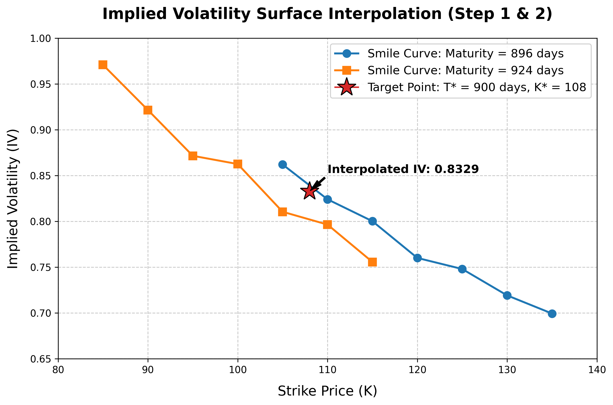

# 📊 Implied Volatility & Options Risk Management

**Author:** Nour Salhi

This project explores **implied volatility** in options markets through data analysis, numerical computation, and visualization. It covers both Call and Put options, implements volatility smile construction, and compares Python and C++ implementations.

---

## 📁 Repository Structure

| File | Description |
|---|---|
| `Data Call.csv` | Raw market data for Call options |
| `Data Put.csv` | Raw market data for Put options |
| `cleaned_options.csv` | Cleaned and preprocessed options dataset |
| `visualization_data.csv` | Processed data used for charts and plots |
| `Data + Visualization Code.ipynb` | Main Python notebook: data cleaning, implied volatility computation, and visualizations |
| `Data + VisualiZation Code.pdf` | PDF export of the Python notebook |
| `Code c++.ipynb` | C++ implementation of the implied volatility computation |
| `volatility_smile_chart.png` | Output chart showing the volatility smile |
| `Implied_Volatility_Report_Nour_Salhi.pdf` | Full written report detailing methodology and findings |

---

## 🔍 Project Overview

The goal of this project is to **compute and analyze implied volatility** from real options market data. Implied volatility is a key metric in financial risk management — it reflects the market's expectation of future price fluctuations and is central to options pricing (Black-Scholes model).

Key steps covered:

- **Data cleaning** — filtering and preparing raw Call/Put options data
- **Implied volatility extraction** — numerical inversion of the Black-Scholes formula
- **Volatility smile visualization** — plotting IV as a function of strike price
- **Cross-language implementation** — Python (Jupyter) and C++ comparison

---

## 📈 Key Output



The volatility smile illustrates how implied volatility varies across different strike prices — a classic pattern observed in real options markets, often explained by market risk aversion and the limits of the Black-Scholes model.

---

## 🛠️ Technologies Used

- **Python** — `pandas`, `numpy`, `scipy`, `matplotlib`
- **C++** — numerical root-finding for IV computation
- **Jupyter Notebook** — interactive analysis and reporting

---

## 🚀 Getting Started

1. Clone the repository:
   ```bash
   git clone https://github.com/nou874/Risk-Management.git
   cd Risk-Management
   ```

2. Install Python dependencies:
   ```bash
   pip install pandas numpy scipy matplotlib
   ```

3. Open the main notebook:
   ```bash
   jupyter notebook "Data + Visualization Code.ipynb"
   ```

---

## 📄 Report

A full written report — `Implied_Volatility_Report_Nour_Salhi.pdf` — is included in the repository. It details the theoretical background, methodology, results, and conclusions of this analysis.

---

## 📬 Contact

Feel free to reach out via GitHub: [@nou874](https://github.com/nou874)
